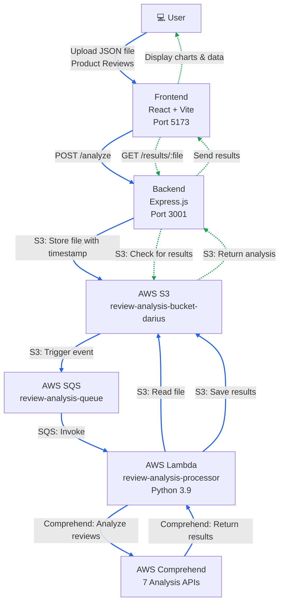
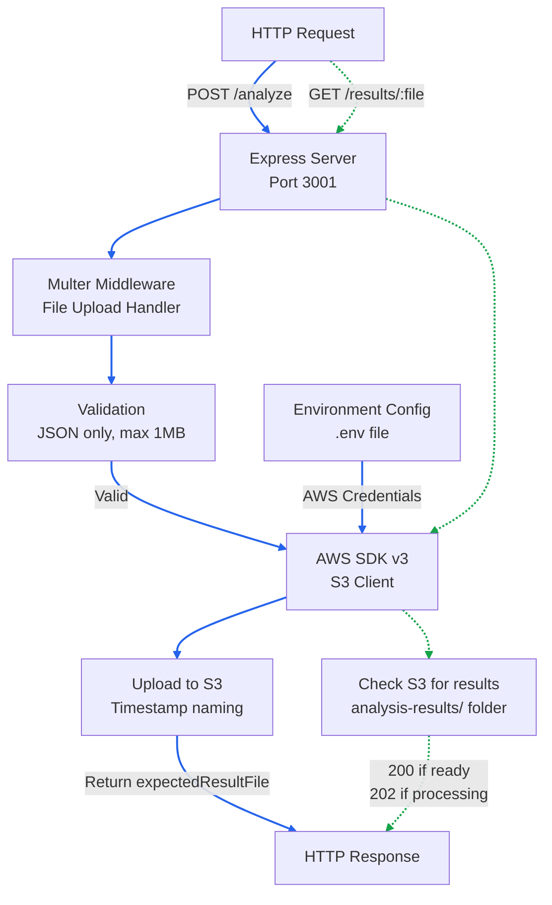
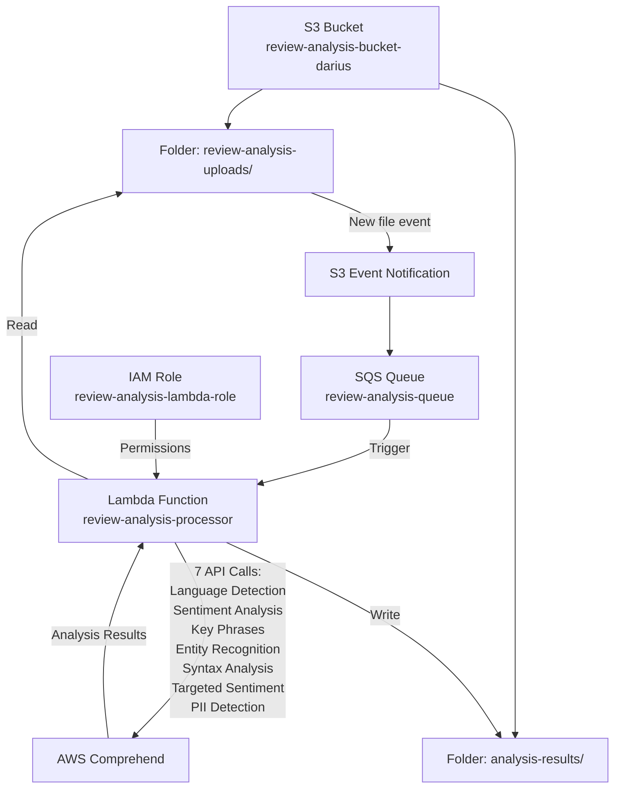

# AWS Comprehend Deep Dive: Enterprise-Scale Product Review Analysis

## Video 01: Complete Serverless Review Analysis Pipeline

This project demonstrates a full-stack, event-driven architecture for automated product review analysis using AWS Comprehend and modern web technologies.

## Architecture Overview

### Complete System Architecture


### Backend Architecture


### AWS Infrastructure


### Components

**Frontend (React + Vite)**
- File upload interface with validation (.json files only, max 1MB)
- Real-time upload status feedback
- Modern React development with Vite

**Backend (Express.js + AWS SDK)**
- File validation and processing
- S3 upload with timestamp-based naming
- Dedicated IAM user with minimal S3 permissions
- Environment-based configuration

**AWS Infrastructure**
- **S3 Bucket**: `review-analysis-bucket-darius`
- **SQS Queue**: `review-analysis-queue`
- **Lambda Function**: `review-analysis-processor`
- **IAM Role**: `review-analysis-lambda-role`

### S3 Folder Structure

```
review-analysis-bucket-darius/
└── 01-aws-comprehend-review-analysis/
    ├── review-analysis-uploads/     # Original JSON files
    └── analysis-results/            # Comprehend analysis results
```

### AWS Services Used

- **Amazon S3**: File storage and event triggers
- **Amazon SQS**: Message queuing for reliable processing
- **AWS Lambda**: Serverless compute for analysis processing
- **Amazon Comprehend**: AI-powered text analysis
  - Sentiment Analysis
  - Entity Recognition
  - Key Phrase Extraction
  - Language Detection
- **IAM**: Security and access management

## What's Implemented

### Frontend Features
- JSON file upload with client-side validation
- File size limit (1MB) and type checking
- Error handling and user feedback
- Responsive design

### Backend Features
- Express.js API with CORS support
- Multer for file upload handling
- AWS SDK S3 integration
- Environment variable configuration
- Dedicated IAM user authentication

### AWS Pipeline
- **Event-Driven**: S3 uploads automatically trigger analysis
- **Serverless**: No infrastructure management required
- **Scalable**: Handles multiple files concurrently
- **Reliable**: SQS ensures message delivery and retry logic
- **Secure**: Minimal IAM permissions and encrypted storage

## Development Setup

### Prerequisites
- Node.js 18+
- AWS CLI configured
- AWS account with appropriate permissions

### Backend Setup
```bash
cd backend
npm install
# Configure .env file with AWS credentials
npm start
```

### Frontend Setup
```bash
cd frontend
npm install
npm run dev
```

### Environment Variables (.env)
```
AWS_ACCESS_KEY_ID=your_access_key
AWS_SECRET_ACCESS_KEY=your_secret_key
AWS_REGION=us-east-1
S3_BUCKET_NAME=review-analysis-bucket-darius
PORT=3001
```

## Usage

1. **Upload Reviews**: Use the frontend to upload JSON files containing product reviews
2. **Automatic Processing**: Files are automatically processed by the AWS pipeline
3. **View Results**: Analysis results are stored in the `analysis-results/` S3 folder

### Sample JSON Format
```json
{
  "reviews": [
    {
      "id": "1",
      "text": "This product is amazing! Great quality and fast shipping.",
      "rating": 5
    }
  ]
}
```

### Analysis Output
```json
{
  "source_file": "2026-02-03T17-45-51-009Z.json",
  "processed_at": "2026-02-03T12:55:00",
  "total_reviews": 1,
  "analysis_results": [
    {
      "original_review": {...},
      "sentiment": "POSITIVE",
      "sentiment_scores": {...},
      "key_phrases": [...],
      "entities": [...]
    }
  ]
}
```

## Technology Stack

- **Frontend**: React 18, Vite, ESLint
- **Backend**: Express.js, AWS SDK v3, Multer, dotenv
- **AWS**: S3, SQS, Lambda, Comprehend, IAM
- **Runtime**: Node.js, Python 3.9 (Lambda)

## Security Features

- Dedicated IAM user with minimal S3 permissions
- Client-side and server-side file validation
- Encrypted S3 storage
- VPC-compatible Lambda function
- Environment-based credential management

## Monitoring & Logging

- CloudWatch Logs for Lambda function monitoring
- S3 access logging
- SQS message visibility and dead letter queue support
- Express.js request logging
